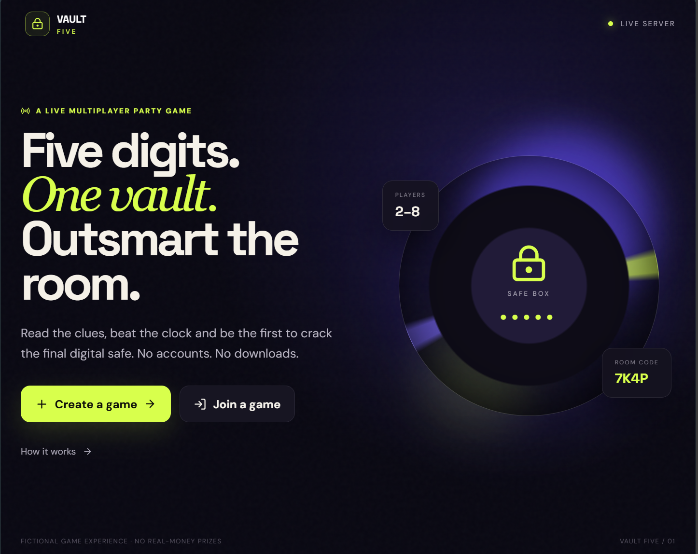
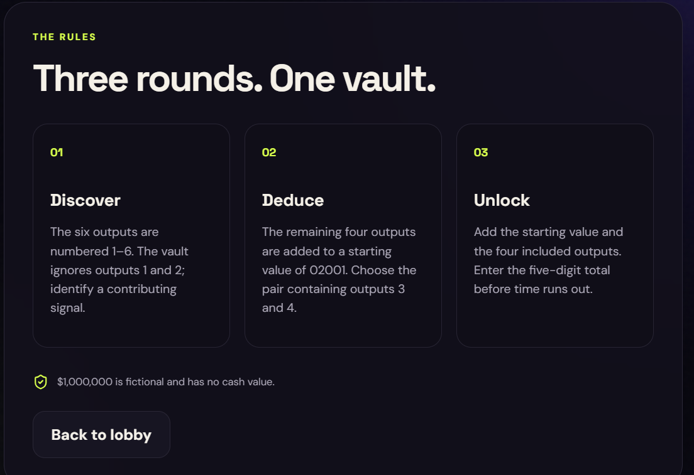
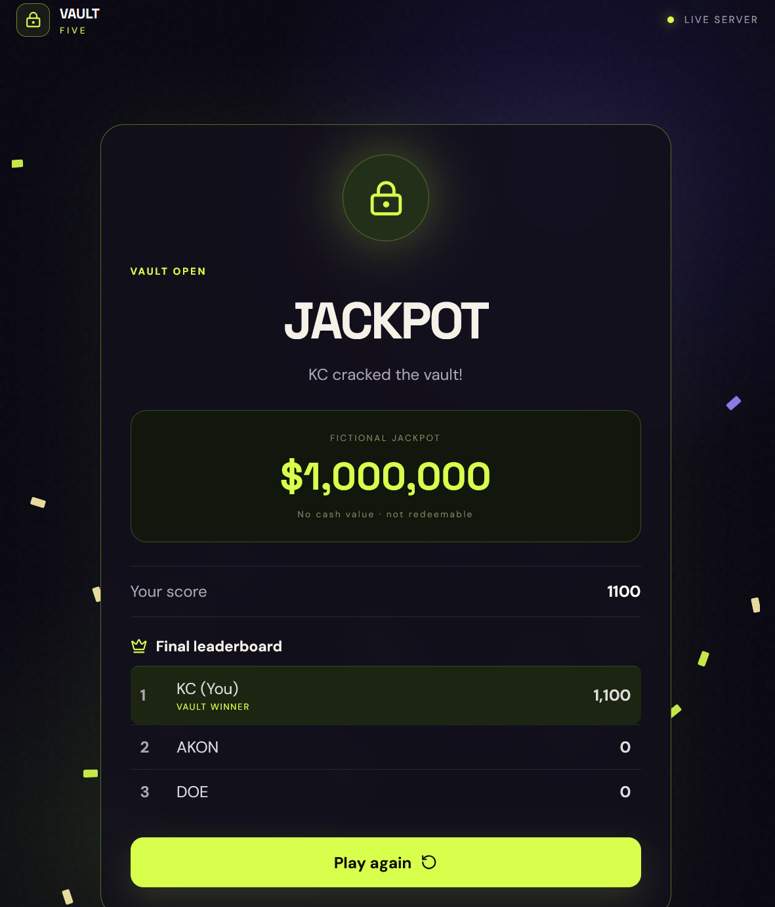
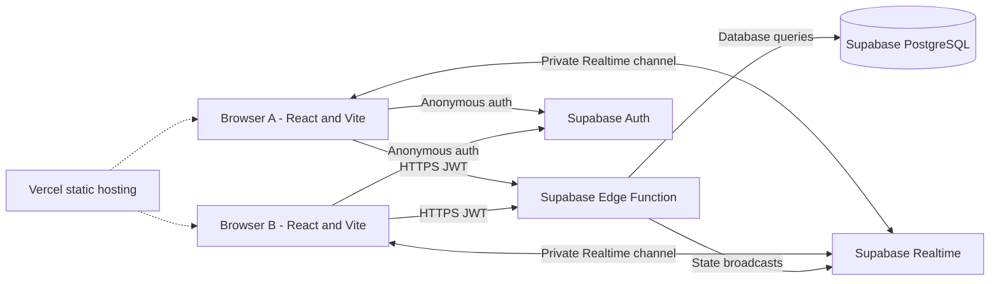
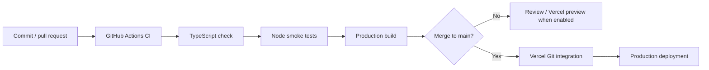
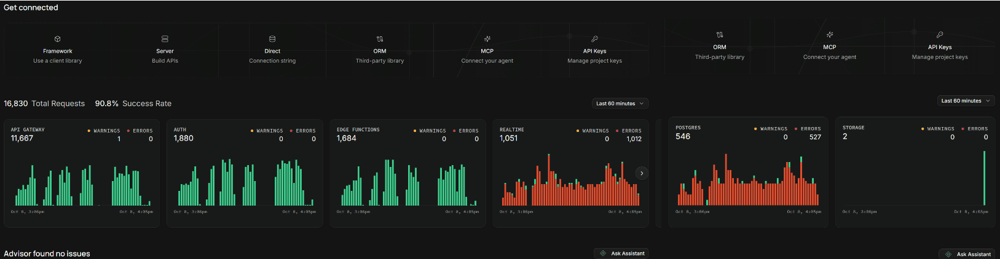

# VAULT FIVE
### Real-time multiplayer systems engineering · serverless state orchestration · deployment automation

[Live application](https://vault-five-umber.vercel.app/) · [Source repository](https://github.com/sampeter-akan/vault-five)

VAULT FIVE is a deployed, browser-based multiplayer deduction application and an engineering case study in **authoritative state management, realtime coordination, serverless APIs, identity-aware authorization, and operational troubleshooting**. Players create four-character rooms, join from separate devices without visible accounts, solve timed numerical challenges, and compete to unlock a fictional vault. The **$1,000,000 jackpot is an in-game display only: no cash value, no wagering, no payout**.

The interesting engineering problem is not rendering a game: it is making independently connected browsers agree on *who is in the room, which round is active, when the deadline expires, which submissions count, and who won*.

> **Deployment status:** Live on Vercel with a Supabase backend. The observed multiplayer walkthrough verified joining, synchronized round screens, automatic progression, score updates, replay, and a three-player winner/leaderboard view. This is a working portfolio project, **not** a claim of enterprise-scale availability, a formal SLO, or load-tested production capacity.

## Product walkthrough

- **Landing:** entry point for hosting or joining a room; no installation or visible sign-up.
- **Rules:** the three-round sequence, scoring, and fictional jackpot terms.
- **Game:** shared timed rounds with server-validated submissions.
- **Outcome:** winner announcement, per-player leaderboard, vault celebration, and replay.

### Landing experience



*Figure 1 — Public-facing entry point. Players access the application in a browser and can create or join multiplayer rooms without installing software or completing a visible registration form.*

### Game rules and player onboarding



*Figure 2 — In-app rules introduce the round structure and player actions. Clear instructions reduce ambiguity when multiple clients interact with the same timed server-side state machine.*

### Successful unlock and synchronized outcome



*Figure 3 — Successful vault-unlock outcome. The winner announcement and leaderboard are generated from the authoritative room state and displayed to connected players; the jackpot is fictional and has no cash value.*

## Architecture



**Trust boundary:** the React client renders state and submits player intent; the Edge Function authenticates callers, checks room membership and host privileges, evaluates answers, changes persistent state, and determines winners. The vault combination belongs only on the server. PostgreSQL stores rooms, players, rounds, submissions, and scores. Realtime broadcasts help clients update promptly; periodic authoritative `state` reads provide a recovery path when broadcasts are missed.

**Technology choices:** React 19, TypeScript, Vite 6, Supabase Auth (anonymous identities), Supabase Edge Functions, Supabase Realtime over WebSockets, PostgreSQL with Row Level Security, GitHub, GitHub Actions, and Vercel. **There is no Socket.IO server, Redis/cache tier, or dedicated container runtime in the deployed architecture.** Vercel serves the built static frontend; Supabase runs managed backend services.

### Round lifecycle and consistency

```mermaid
stateDiagram-v2
  [*] --> Lobby
  Lobby --> Discover: Host starts; minimum two players
  Discover --> Deduce: Server deadline reached
  Deduce --> FinalVault: Server deadline reached
  FinalVault --> Results: Valid unlock or deadline reached
  Results --> Lobby: Host replay/reset
```



- Room codes identify a shared game session; anonymous Auth provides a distinct backend identity per browser session.
- Server-managed round timestamps anchor the countdown. Clients display remaining time using the authoritative deadline rather than starting independent timers.
- State polling (currently about every **2 seconds** during an active room) reconciles stale clients even if a Realtime event is missed. State reads can advance an expired round.
- Database constraints include one submission per player per round, score non-negativity, and room/round relationships. The application uses server-side validation rather than trusting a client-reported “correct” flag.
- Winner identity and the `vault_unlocked` outcome are persisted; every client renders the same final leaderboard from returned room state.
- **Concurrency caveat:** no formal race-condition or simultaneous-correct-answer stress test has been published. Transaction-level winner arbitration, idempotent retries, and contention tests remain hardening work, not verified guarantees.

## Run locally

Prerequisites: **Node.js 22**, npm, and (for live multiplayer) a Supabase project with the deployed `game` Edge Function, database schema/policies, Realtime configuration, and anonymous sign-ins enabled.

```bash
git clone https://github.com/sampeter-akan/vault-five.git
cd vault-five
npm install
cp .env.example .env.local
npm run dev
```

Configure `.env.local`:

```dotenv
VITE_SUPABASE_URL=https://YOUR_PROJECT_REF.supabase.co
VITE_SUPABASE_ANON_KEY=YOUR_SUPABASE_PUBLISHABLE_KEY
```

The variable named `VITE_SUPABASE_ANON_KEY` accepts the modern Supabase **publishable** key. It is designed for client use; authorization must still be enforced server-side and by RLS. Never place the Supabase service-role key, database password, or `VAULT_KEY` in a `VITE_*` variable. Configure the vault key as a **Supabase Edge Function secret**, not in source control. Do not use an actual payment credential or real-money prize configuration.

```bash
npm run lint       # TypeScript static checks
npm test           # Node built-in architectural smoke tests
npm run build      # TypeScript project build + Vite production bundle
npm run preview    # Serve the built frontend locally
```

With missing Supabase frontend variables, the UI offers a **local simulation mode**. This is suitable for presentation review but **does not validate real cross-device multiplayer or backend security**. A fresh Supabase environment requires the actual deployed backend function and security migrations; the checked-in SQL is a reference snapshot, **not a complete one-command environment bootstrap**.

## CI/CD and deployment



**Implemented in repository:** `.github/workflows/ci.yml` runs on pull requests and pushes to `main`; it installs dependencies, runs `npm run lint`, `npm test`, and `npm run build`. Vercel's project integration builds the Vite application with `npm run build` and publishes `dist` (see `vercel.json`). Production is currently accessible at the live URL above.

**Important distinction:** GitHub Actions CI and Vercel deployment are **separate triggers**. This repository does **not** currently enforce “CI must pass before production deploy”; that requires GitHub branch protection and/or Vercel deployment checks. Pull-request previews depend on the Vercel Git integration and project settings; a staging environment with its own Supabase backend has not been established. Do not interpret the diagram as a verified gated promotion workflow.

**Environment separation:** configure frontend publishable URL/key in Vercel Production and Preview environments as appropriate. A preview pointing at production Supabase can alter live rooms; use a separate staging Supabase project before treating previews as isolated integration tests.

**Rollback:** identify the last known-good Vercel deployment and use Vercel's dashboard rollback/redeploy capability, subject to plan and project support. Frontend rollback does not reverse Supabase migrations or Edge Function releases; backend compatibility and forward-only database migration plans must be evaluated separately. Keep secrets in platform settings and rotate them if compromised.

**Containers:** the live application is **not containerized**. A Dockerfile and image-publishing pipeline would be a valid future reproducibility exercise, but should not be listed as a delivered feature until built and tested.

## Observability and reliability

**Operational runbook:** [Production checks, incident triage, log inspection and rollback](docs/OPERATIONS.md). This provides a repeatable two-client release checklist and separates currently available platform logs from metrics and alerts not yet implemented.


The project currently uses **Supabase function/database logs and operational dashboards** plus Vercel deployment/build status for investigation. The database-request screenshot below shows platform-level activity; **it is not evidence of a custom metrics stack, latency SLO, or load test**.



*Figure 4 — Supabase database-request view used as operational context. Request activity helps orient investigation, but does not by itself measure end-to-end application latency, WebSocket connection counts, or availability.*

| Signal | Where to inspect now | Current limitation / next instrument |
|---|---|---|
| API failures | Supabase Edge Function logs and browser error feedback | Structured per-action status and error counters not yet exported |
| Request latency (p50/p95/p99) | Platform telemetry where available | Add function duration histogram and dashboard |
| Active rooms / concurrent players | PostgreSQL `rooms` / `players` records | `connected` is a presence hint, not verified simultaneous WebSocket count |
| Realtime connections | Supabase Realtime/platform usage metrics where available | No dedicated per-room connection dashboard |
| Deploy failures | GitHub Actions run results; Vercel deployment logs | Add notifications and automated smoke checks |
| Recovery | Browser state polling and reconnect message | Test refresh/rejoin, offline recovery, and transient backend failures |

**Suggested service indicators (not measured SLOs):** successful state-request rate, p95 Edge Function duration, time-to-room-sync after a missed event, round-transition delay, and reconnect success rate. Establish baselines with scripted multi-client tests before setting targets or claiming availability percentages.

### Operational checks

1. Verify the latest GitHub Actions build and Vercel deployment are green.
2. In separate browser sessions, create and join a room; confirm every participant sees the same roster.
3. Start a round and compare the round label and countdown on all clients.
4. Submit a correct and incorrect answer; confirm server-scored outcomes.
5. Test timeout progression, winner announcement, replay, and refreshing a participant mid-round.
6. Inspect Supabase function logs if a client shows a request error; distinguish HTTP errors from UI synchronization failures.

## Security and multiplayer threat model

| Concern | Current design | Remaining work |
|---|---|---|
| Identity | Invisible Supabase anonymous Auth session; bearer JWT sent to the Edge Function | Abuse controls and session expiry/recovery tests |
| Authorization | Function validates authenticated identity and room/host actions; database RLS enabled | Audit every mutation and privilege boundary |
| Secret handling | Vault combination stored as backend-only secret; service-role credentials stay server-side | Secret rotation/runbook and automated secret scanning |
| Input validation | Room code, display name, round answers and vault submission validated; database check constraints | Fuzz tests and consistent error taxonomy |
| Anti-cheat | Server checks answers, scores and deadlines; frontend cannot self-award points | Adversarial concurrency and replay tests |
| Rate limiting | No dedicated per-IP/per-user rate limiter has been verified | Add throttling for room creation, joining and guesses |
| Persistence | PostgreSQL tables for rooms, players, rounds, submissions and scores | Retention policy, backup/restore drill, race tests |
| Scaling | Managed stateless Edge Functions and Supabase Realtime; no self-hosted sticky sessions | Load test provider quotas, Realtime fan-out and DB contention |

**Scaling approach:** API requests are stateless at the frontend tier; shared durable game state lives in Postgres rather than a specific web server's memory. Managed WebSocket fan-out is delegated to Supabase Realtime. This avoids self-hosted sticky sessions but **does not guarantee unlimited concurrency**: provider connection limits, function invocation limits, polling volume, and write contention must be measured. The UI indicates up to **8 players per room**; this is a product limit, not a measured capacity benchmark.

## Engineering incident reviews

These are development/test incidents observed during live multi-browser validation, not claims of externally monitored production outages.

**1. Room creation returned HTTP non-2xx.** Browser displayed an unhelpful Edge Function error. Supabase logs exposed a unique-index violation on `players.auth_user_id`: one anonymous identity could not join more than one room over time. The live database index was changed to uniqueness on `(room_id, auth_user_id)`. **Follow-up:** the checked-in `supabase/schema.sql` still needs reconciliation with the applied live migration; do not replay its old global uniqueness index into a fresh environment. Add schema drift checks to CI.

**2. Host and joiner saw different stages.** One browser remained in the lobby while another advanced rounds. The client was depending too heavily on broadcast delivery; a joining-player path also failed to persist the active room code. Changes saved the room for both host and joiners and introduced periodic authoritative state reads. Subsequent screenshots showed synchronized rounds and final results. **Follow-up:** test network interruption, browser backgrounding, reconnect latency, and multi-device scale.

**3. Vault button appeared unresponsive.** Incorrect submissions had no immediate user-facing feedback. Added “Checking combination…” while processing and a server-response message for incorrect entries. Later test sessions verified a successful vault unlock and consistent winner announcement. **Follow-up:** add automated submission-state tests and better timeout/error distinctions.

**4. Results lacked attribution.** Initially both screens showed a jackpot but not who won. The results view now names the winner, ranks participants, and animates the vault celebration; screenshots confirmed the same winner and leaderboard across two browsers. **Follow-up:** validate reduced-motion behavior and small-screen layouts.

## What this project demonstrates

- **Systems thinking:** one server-owned state machine shared by independent browsers, with deadline-driven transitions and a reconciliation path.
- **DevOps practice:** reproducible build commands, Git-based deployment, CI checks, environment separation considerations, and rollback documentation.
- **Reliability engineering:** actual error investigation using backend logs, failure-mode analysis, and iterative correction from multi-session testing.
- **Security awareness:** anonymous identity, room-scoped authorization, RLS, server-side scoring and secret isolation, with explicit remaining abuse controls.
- **Engineering honesty:** documented gaps around load testing, instrumentation, containers, deployment gating, and full recovery verification.

## Documentation assets

The four screenshots shown above are versioned in [`docs/images/`](docs/images/) alongside this README. Relative Markdown image paths allow GitHub to render them directly from the repository, keeping the product walkthrough and operational evidence close to the engineering documentation.

---

**Live:** https://vault-five-umber.vercel.app/ · **Repository:** https://github.com/sampeter-akan/vault-five

**Project focus:** DevOps/SRE-oriented platform engineering demonstrated through a playable real-time application.